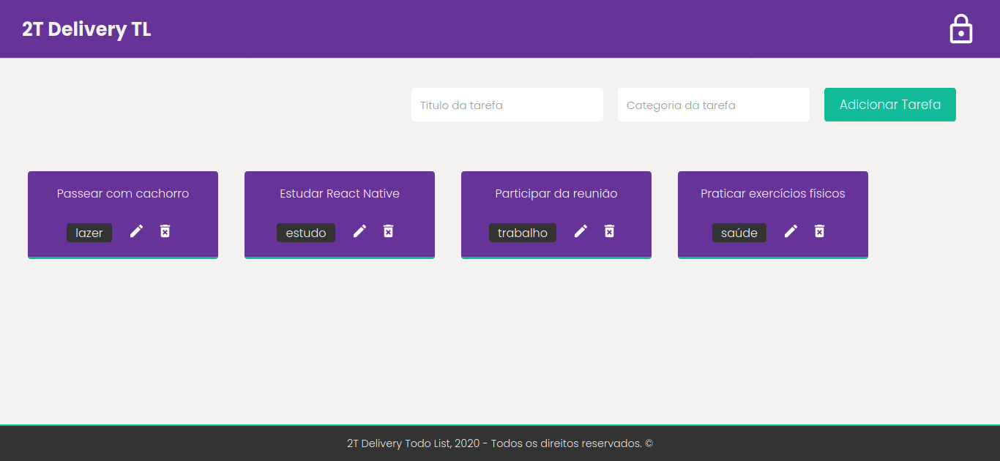

# 2t-delivery-todo-list

## Project

***EN:*** This application was developed in order to participate in the challenge proposed by the startup 2T as a technical test of their selection process, basically this project is a whole list built in Node.js on the back-end and ReactJS on the front-end with features such as register and login, add delete, edit , and remove tasks.

***PT-BR:*** Esta aplicação foi desenvolvida com o intuito de participar do desafio proposto pela startup 2T como teste técnico do processo seletivo deles, basicamente este projeto é uma todo list construída em Node.js no back-end e ReactJS no front-end com funcionalidades como cadastro e login, adicionar deletar, editar, e remover tarefas.

This project was developed with the following technologies:

- Node.js
- Express.js
- MongoDB & Mongoose
- Typescript
- Yup
- JWT & bcryptjs
- ReactJS
- Styled Components
- React Icons
- Axios
- {...}
***

## Preview Web

***

### How To Install

To clone and run this application, you'll need Git, Node.js & NPM/Yarn installed on your computer.

From your command line:

#### Install API

```bash
# Clone this repository
$ git clone https://github.com/gideonfernandes/2t-delivery-todo-list.git

# Go into the repository
$ cd 2t-delivery-todo-list

# Install dependencies
$ yarn install

# Start server
$ yarn dev:server

# running on port 8888
```

#### Install Client

```bash
# Go into the repository
$ cd 2t-delivery-todo-list/client

# Install dependencies
$ yarn install

# Run
$ yarn start

# running on port 3000
```

### License

This project is under the MIT license.
